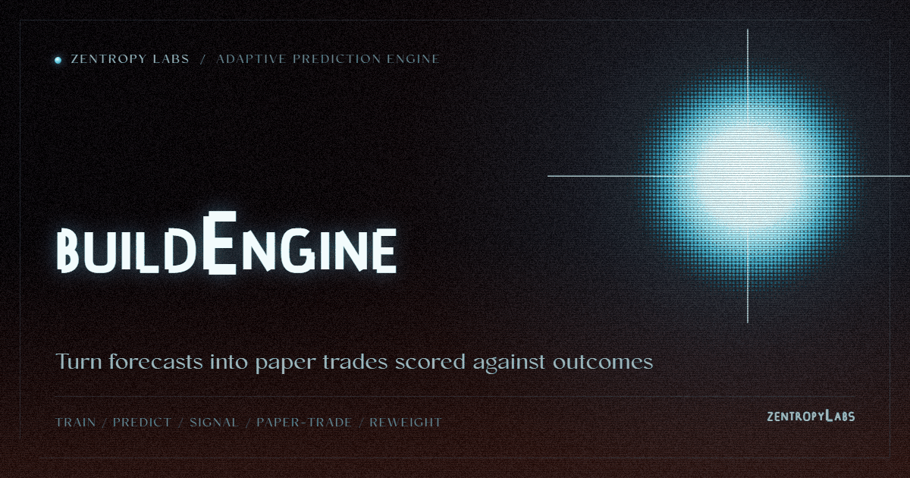

<p align="center">
  
</p>
<!-- Project mark: docs/brand/build-engine-mark.svg -->

# Build Engine

> Self-improving adaptive prediction and paper-trading engine that bridges `build-oracle` forecasting models to `build-finance` execution through an accuracy feedback loop.

[Project Telos](https://harperz9.github.io) | [gather](https://github.com/HarperZ9/gather) | [crucible](https://github.com/HarperZ9/crucible) | [index](https://github.com/HarperZ9/index) | [forum](https://github.com/HarperZ9/forum) | [telos](https://github.com/HarperZ9/telos) | [emet](https://github.com/HarperZ9/emet) | [buildlang](https://github.com/HarperZ9/buildlang)

[](https://github.com/HarperZ9/build-engine/actions/workflows/ci.yml)


[](LICENSE)

> **Not financial advice.** Paper trading is the default; live broker
> execution is explicit opt-in and gated; the engine custodies no funds. Read
> [SECURITY.md](SECURITY.md) before enabling live mode.

Build Engine is a paper-first adaptive prediction engine for market research,
strategy simulation, and model feedback loops.

It connects `build-oracle` forecasting models with `build-finance` paper
trading and backtesting primitives so predictions can be evaluated against
outcomes instead of left as static charts.

This repository is published as fair-source software. The code is available for
review, use, and building on, while commercial use that competes with the project
is reserved under the license in this repository.

## What It Does

```text
Market data -> models train -> predictions -> paper trades
       ^                                      |
       |                                      v
       +--------- results and weights <-------+
```

- Trains forecasting models through `build-oracle`.
- Converts model forecasts into strategy signals.
- Runs those signals through `build-finance` paper execution primitives.
- Tracks directional accuracy and adjusts model weights over time.
- Keeps live broker execution behind explicit private-risk gates.

## Install

```bash
pip install -e ../build-oracle
pip install -e ../build-finance
pip install -e .
```

The GUI code remains private/license-gated until the Qt binding posture is
resolved. The public-ready package path is CLI and library first.

## Paper Mode

Paper trading is the default.

```bash
build-engine run --symbols AAPL,BTC-USD --paper --cycles 10
```

Backtest the prediction strategy:

```bash
build-engine backtest --symbols AAPL --days 252 --monte-carlo
```

Check status:

```bash
build-engine status
```

## Live Broker Mode

Live broker mode is not the default public path. It requires all of the
following:

- `--live`
- `BUILD_ENGINE_LIVE_ACK=I_UNDERSTAND_LIVE_RISK` or matching `--live-ack`
- `APCA_API_KEY_ID`
- `APCA_API_SECRET_KEY`

Example with placeholders:

```powershell
$env:BUILD_ENGINE_LIVE_ACK="I_UNDERSTAND_LIVE_RISK"
$env:APCA_API_KEY_ID="<paper-or-live-key-id>"
$env:APCA_API_SECRET_KEY="<paper-or-live-secret>"
build-engine run --symbols AAPL --live --live-ack I_UNDERSTAND_LIVE_RISK --cycles 1
```

The engine does not persist broker API keys or the live-mode acknowledgement in
its saved state.

## Python API

```python
from build_engine.adaptive_engine import AdaptiveEngine
from build_engine.config import EngineConfig

config = EngineConfig(
    symbols=["AAPL", "BTC-USD"],
    models=["arima", "prophet"],
    paper_trading=True,
)

engine = AdaptiveEngine(config)
result = engine.run_cycle()
print(f"Equity: ${result['equity']:,.2f}")
print(f"Accuracy: {result['accuracy']:.0%}")
```

## Risk Posture

This software is research and engineering tooling. It is not investment,
financial, legal, tax, or trading advice. Model output can be wrong, delayed,
overfit, incomplete, or inappropriate for real capital allocation. Paper mode is
the supported default. Live broker mode is a private-risk capability and should
be used only by an operator who understands the consequences.

## Architecture

| Module | Role |
| --- | --- |
| `config.py` | Central configuration dataclass and live-mode acknowledgement constant. |
| `model_trainer.py` | Wraps `build-oracle` model fitting and prediction. |
| `prediction_strategy.py` | Bridges oracle forecasts to `build-finance` signals. |
| `performance_tracker.py` | Tracks accuracy and computes dynamic model weights. |
| `adaptive_engine.py` | Wires model training, prediction, broker setup, and feedback. |
| `persistence.py` | Saves non-secret engine state and trade history. |
| `cli.py` | Command-line interface. |

## Verification Snapshot

Current release-gate evidence is recorded in the workspace roadmap contract:

`project-docs/roadmaps/contracts/product-use-case-build-engine-2026-06-12.json`

The public claim is intentionally narrow: adaptive forecasting and paper-first
execution are verified; live broker mode remains explicit and private-risk
gated.

## About The Author

Build Engine is part of Zain Dana Harper's Build workspace: a set of language,
state, forecasting, color, and verification tools built around practical
experiments rather than conventional product categories. The work is
deliberately cross-disciplinary: compiler thinking, market simulation, visual
systems, and local-first safety boundaries.

## License

Copyright (c) 2022-2026 Zain Dana Harper. All rights reserved.

Build Engine is released under the FSL-1.1-MIT.
The source is available: you may read, run, copy, modify, and redistribute it for
any purpose other than a Competing Use. Commercial use that competes with the
project is reserved to the Licensor and requires a separate commercial license.
See `LICENSE` for the full terms.

---

**[Zentropy Labs](https://github.com/ZentropyLabs-ai)** · order out of entropy. An independent lab building evidence-first tools that leave a re-checkable artifact behind. Built by Zain Dana Harper in Seattle. The full workbench is at [Project Telos](https://harperz9.github.io).
